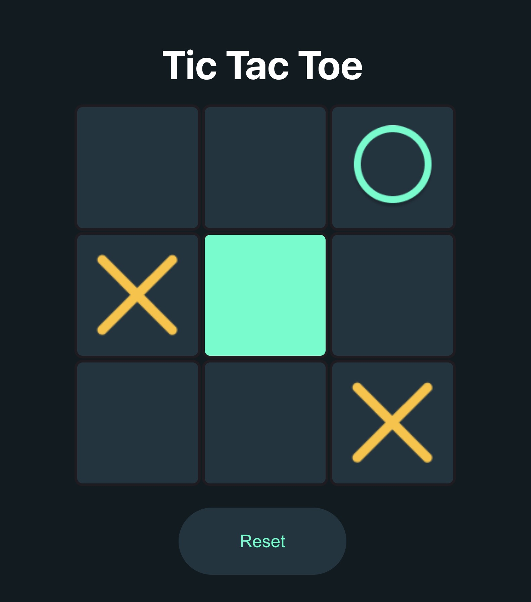

# Tic-Tac-Toe Game

Welcome to my Tic-Tac-Toe project! This is an interactive two-player Tic-Tac-Toe game built using React. The game allows players to take turns, track progress, and determine a winner or declare a draw based on the game status.

## Project Overview

- **Website**: Tic-Tac-Toe Game
- **Framework**: React.js
- **Languages**: JavaScript, CSS
- **Deployment**: GitHub Pages
- **Features**:
  - Two-player turn-based gameplay.
  - Updates game board in real-time with each player's move.
  - Declares the winner or a draw at the end of the game.
  - Provides an option to replay the game.
  - Responsive design for mobile and desktop users.
  
## Website Preview

Play the Tic-Tac-Toe game at: [Tic-Tac-Toe Demo](https://ruhisawant.github.io/TicTacToe/)

## Getting Started

To run the project locally:

1. Clone this repository: git clone https://github.com/ruhisawant/TicTacToe.git
2. Navigate to the project directory: cd tictactoe
3. Install dependencies: npm install
4. Start the development server: npm start
5. Open your browser and visit: http://localhost:3000/

## Acknowledgements

This project was built by following the tutorial: **How To Make Tic Tac Toe Game In React | Create Tic-Tac-Toe Using React JS**.

Thank you for visiting and enjoy playing Tic-Tac-Toe!
